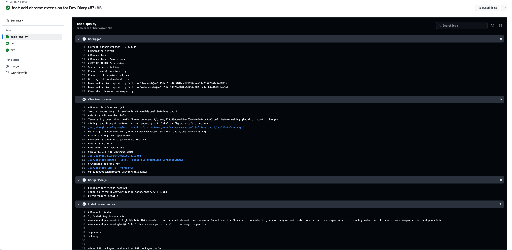
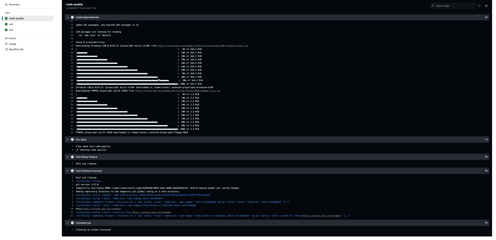
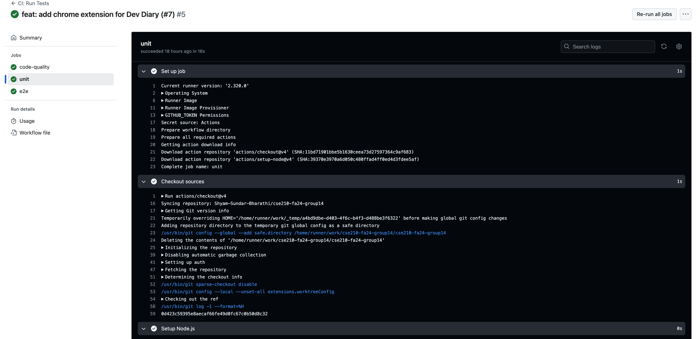
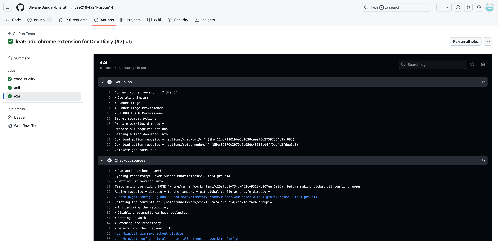
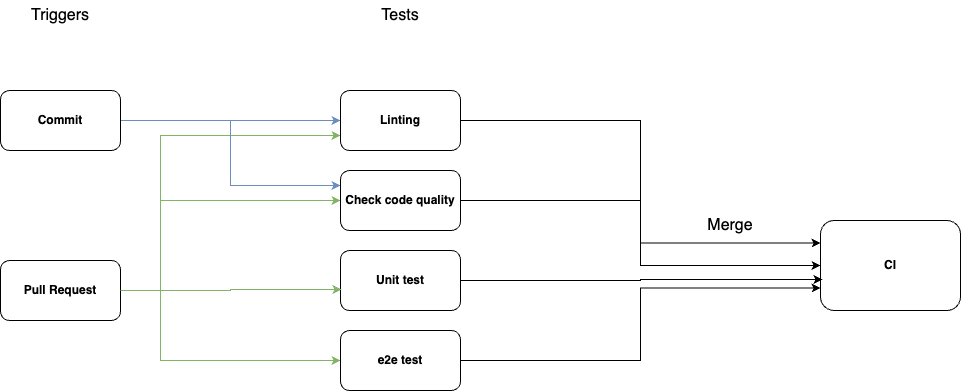

# CI Pipeline

This document provides a status update on the current state of the Continuous Integration (CI) pipeline. The pipeline is evolving with various stages implemented and others planned for future phases. Below is an overview of the currently functional pipeline components, as well as the features in progress or planned.

## Functional Pipeline Components

### 1. **Linting**  

Currently, linting is applied to pull requests (PRs) specifically for the PR title. This helps enforce standardized naming conventions and ensure that all PRs follow a consistent format before they are merged. Future iterations may extend this to code linting using tools like ESLint or Prettier, both within the editor and during the CI pipeline.
Below is the current linting frame in our repository.

### 2. **Code Quality via Automation**

We are using GitHub Actions for automating code quality checks. The pipeline will integrate with static analysis tools like **CodeClimate** or **Codacy** in the future to provide automated insights into the codebase’s maintainability and identify potential issues, such as code complexity or duplicated code. This process helps maintain high-quality code without manual intervention.
Below is the current code quality checking component in our repository.

### 3. **Human Code Review (via Pull Requests)**

 Every change submitted via a pull request undergoes peer review. Reviewers examine the code for correctness, clarity, and adherence to best practices before approving the changes. This process ensures that the codebase remains clean and maintainable and allows for knowledge sharing among team members.

### 4. **Unit Testing via Automation**

Automated unit tests are an integral part of the CI pipeline. Currently, **Jest** and **Mocha/Chai** are being used for unit testing. These tests are triggered automatically whenever code changes are pushed or pull requests are submitted. Unit tests help ensure that the individual components of the code work as expected and that new changes do not introduce regressions.
Below is the current unit tests in our repository.

### 5. **End-to-End Testing (E2E)**

End-to-end testing has been implemented using **Cypress** and **Playwright**. These tests simulate user behavior and interactions with the application to ensure that all parts of the system work together correctly. The E2E tests are automated in the pipeline, running with each PR to verify that the application functions as expected from a user's perspective.
Below is the current e2e tests in our repository.

## Planned or In Progress

### 1. **Linting on Code (Editor and Pipeline)**

While PR title linting is functional, future work will extend linting capabilities to the code itself. Tools like **ESLint** or **Prettier** will be integrated into both the editor and the CI pipeline to enforce coding standards automatically. This will help reduce errors and inconsistencies in the codebase.

### 2. **Documentation Generation**

We plan to integrate documentation generation into the pipeline. Tools like **JSDoc** will be used to automatically generate documentation based on the code. This will keep the project’s documentation up to date with minimal manual effort.

## Diagram: CI Pipeline Overview

Below is the current diagram representing the stages of the CI pipeline, highlighting the functional components and showing where future enhancements are planned.

## Conclusion

The CI pipeline is evolving steadily with key features already in place to ensure high code quality, efficient testing, and thorough human review. As the pipeline grows, additional steps for code coverage, packaging, and documentation generation will be implemented to further enhance the development workflow. However, at this stage, deployment (CD) is not yet part of the pipeline since the app is being developed and tested locally without a server-based deployment process.
